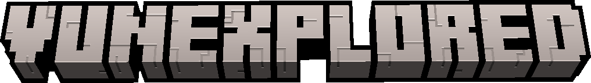

## Un proyecto de codigo abierto.

**Vunexplored** se trata de un juego Sandbox echo en godot engine 4.1.7 de voxeles isometrico 2D, cada sprite es de 32x32 pixeles, todo en un spritesheet fabricado con [PISKEL](https://piskelapp.com) que funciona como **tiles en godot**.

##
